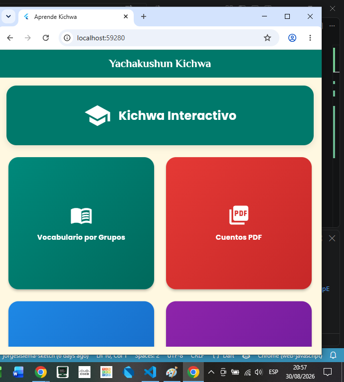
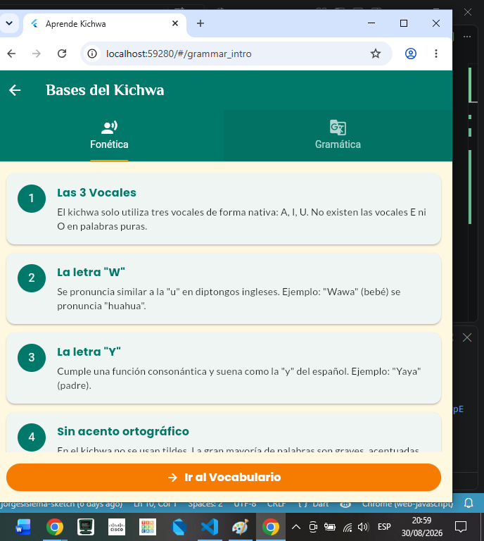
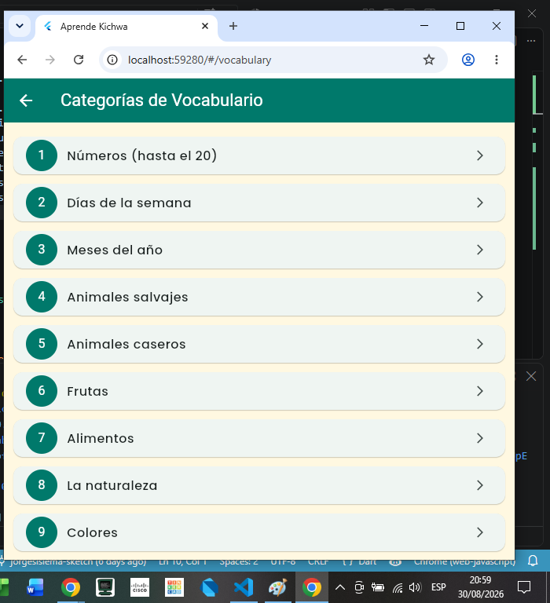
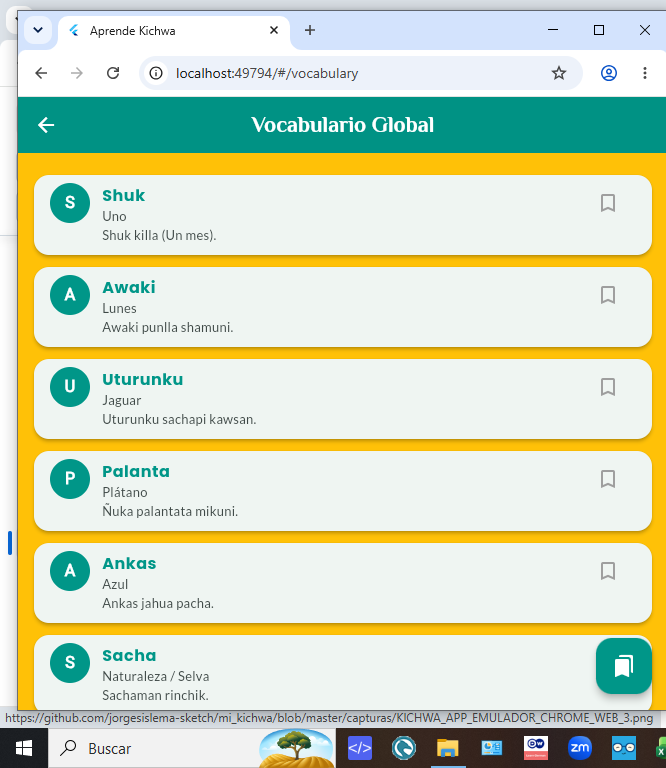
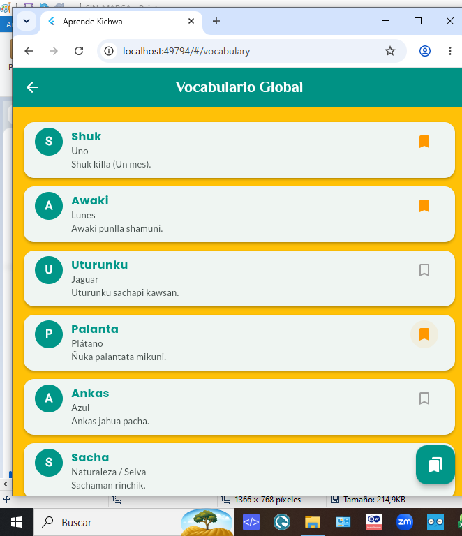

# Yachakushun Kichwa (Versión Provider)

Aplicación móvil educativa e interactiva diseñada para la enseñanza y preservación del idioma Kichwa, implementando una arquitectura desacoplada basada en la gestión de estado global de Flutter.

---

## Actividad Integradora 3: Flutter con Provider y componentes reutilizables.

## Objetivo del Proyecto
Desarrollar una aplicación robusta y escalable aplicando el patrón de manejo de estado **Provider**, optimizando el rendimiento de renderizado a través de componentes y widgets reutilizables, y separando de forma estricta las responsabilidades del software en archivos independientes y subcarpetas funcionales.

## Descripción de la Aplicación
"Yachakushun Kichwa" es una plataforma móvil de inmersión lingüística. Guía al estudiante a través de un flujo pedagógico estructurado: bases gramaticales/fonéticas, exploración de vocabulario clasificado, juegos interactivos multimedia, audios y cuentos en PDF. El sistema utiliza reactividad global para que el progreso, marcadores y configuraciones del alumno estén disponibles en tiempo real en todas las capas de la interfaz.

---

## Funcionalidades Principales
*   **Introducción Teórica Interactiva:** Vista modular por pestañas para comprender la regla de las 3 vocales y la estructura sintáctica Sujeto-Objeto-Verbo (SOV).
*   **Gestión Centralizada de Vocabulario:** Despliegue dinámico de términos mediante colecciones optimizadas en memoria.
*   **Módulo de Favoritos en Tiempo Real:** Capacidad de guardar o quitar marcadores de palabras desde cualquier pantalla y ver los cambios reflejados de forma inmediata.
*   **Retos de Selección y Traducción:** Dinámica interactiva de aprendizaje activo con mutación de datos sincrónica.
*   **Asociación Visual y Multimedia:** Caja de herramientas multimedia que consume imágenes optimizadas y archivos de audio remotos.
*   **Visor de Literatura Andina:** Lector integrado de cuentos tradicionales en formato PDF que opera en caché sin sobrecargar el almacenamiento físico del dispositivo.

---

## Tecnologías y Paquetes Utilizados
*   **Flutter SDK & Dart Language:** Framework base para el desarrollo nativo multiplataforma.
*   **`provider` (v6.1.2):** Paquete oficial para la inyección de dependencias y gestión de estado reactivo mediante `ChangeNotifier`.
*   **`google_fonts` (v6.2.0):** Motor de renderizado tipográfico para las fuentes *Poppins, Lato y Philosopher*.
*   **`cached_network_image` (v3.4.1):** Descarga, renderizado y persistencia temporal en caché de recursos gráficos en la nube.
*   **`flutter_cached_pdfview` (v0.4.3):** Lector nativo asíncrono para archivos PDF en línea.
*   **`audioplayers` (v6.0.0):** Controlador de flujos multimedia de sonido sincronizados con elementos de control interactivos.

---

## Estructura de Carpetas del Proyecto
El diseño del software sigue un patrón de ordenamiento de responsabilidades limpias (Clean Layout), evitando concentrar la lógica en el archivo maestro:

```text
lib/
│── main.dart                  # Punto de entrada de la app e inyección del Provider raíz
├── models/
│   └── word_model.dart        # Clase o modelo de datos principal
├── providers/
│   └── kichwa_provider.dart   # Lógica de negocio (ChangeNotifier y notifyListeners)
├── widgets/
│   ├── custom_app_bar.dart    # Componente reutilizable: Barra de navegación centralizada
│   └── word_card_widget.dart  # Componente reutilizable: Tarjeta interactiva de vocabulario
└── screens/
    ├── home/
    │   └── home_screen.dart   # Menú principal y distribución por GridView
    ├── grammar/
    │   └── grammar_intro_screen.dart # Pestañas informativas de fonética y gramática
    ├── vocabulary/
    │   └── vocabulary_screen.dart    # Lista global consumida mediante Consumer
    ├── selection/
    │   └── word_selection_screen.dart# Juego de traducción reactiva
    ├── matching/
    │   └── word_match_game_screen.dart# Asociación de tarjetas visuales
    └── favorites/
        └── favorites_screen.dart     # Panel exclusivo de marcadores guardados
```

---

## Explicación del Provider Implementado
La aplicación implementa el estado global a través de la clase `KichwaProvider`, la cual extiende de `ChangeNotifier`. 

1.  **Inyección:** En el archivo `main.dart`, se envuelve toda la aplicación dentro de un `ChangeNotifierProvider` para que el estado esté disponible en cualquier nodo del árbol de widgets.
2.  **Notificación:** Cuando el usuario presiona el botón de marcador en cualquier tarjeta, se ejecuta el método `toggleFavorite(id)`. Este altera la propiedad booleana `isFavorite` del modelo y ejecuta **`notifyListeners()`**.
3.  **Consumo:** Las pantallas como `VocabularyScreen` y `FavoritesScreen` utilizan componentes **`Consumer`**. Al escuchar la notificación, estos componentes se redibujan de manera quirúrgica y automática, garantizando que si una palabra es marcada como favorita, aparezca instantáneamente en la lista de favoritos sin necesidad de recargar la pantalla.

---

## Descripción de los Widgets Reutilizables Creados
Para cumplir con las buenas prácticas de diseño atómico y reciclaje de código, se crearon dos componentes independientes:

1.  **`CustomAppBar` (`custom_app_bar.dart`):** Abstracción del `AppBar` nativo que hereda `PreferredSizeWidget`. Centraliza el estilo tipográfico de la aplicación, el color corporativo institucional Teal y permite inyectar componentes inferiores opcionales como barras de pestañas (`TabBar`).
2.  **`WordCardWidget` (`word_card_widget.dart`):** Tarjeta contenedora estandarizada encargada de dar formato estructural a los términos en Kichwa, traducciones en español y ejemplos de uso. Contiene de forma aislada el botón de acción reactivo conectado al `Provider`, permitiendo su reutilización exacta tanto en el visor de vocabulario general como en el panel de favoritos.

---

## Capturas de Pantalla y Evidencia de Provider


### Pantallas Principales de la Aplicación

| Menú Principal (Home) | Bases y Reglas | Vocabulario Completo |
|:---:|:---:|:---:|
|  |  |  |

### Evidencia de Reactividad (Acción con Provider)

| 1. Palabra normal en lista | 2. Se marca como Favorito | 3. Reflejado instantáneamente |
|:---:|:---:|:---:|
|  |  |  |


---

## Instrucciones Básicas para Ejecutar el Proyecto
1. Clonar este repositorio en tu máquina local:
    ```bash
    git clone https://github.com
    ```
2.  Asegurar una conexión activa a internet en el equipo o emulador para la descarga de fuentes y multimedia.
3.  Instalar y actualizar los paquetes de dependencias registrados en el archivo de configuración:
    ```bash
    flutter pub get
    ```
4.  Ejecutar el proyecto en un emulador Android o dispositivo físico en modo de depuración:
    ```bash
    flutter run
    ```

---

## Autor
*   **Estudiante:** Jorge Ivan Sislema Quinaluisa
*   **Asignatura:** Desarrollo de Aplicaciones Móviles

-----------------------------------------------------------------------

# Yachakushun Kichwa - Aplicación Móvil Educativa

Módulo interactivo y pedagógico diseñado para la enseñanza, difusión y preservación del idioma Kichwa mediante entornos móviles dinámicos.

---

## Actividad Integradora 2: Mejoras y Nuevas Funcionalidades

### Descripción Breve de la Aplicación
"Yachakushun Kichwa" es una aplicación móvil interactiva orientada a la inmersión lingüística en el idioma Kichwa. Su propósito central es guiar al estudiante de forma progresiva, partiendo desde los fundamentos fonéticos y gramaticales andinos, pasando por la categorización léxica, hasta llegar a retos interactivos multimedia como la validación escrita y el emparejamiento visual de elementos culturales.

### Continuidad del Proyecto
*   **Estado:** **Se continuó y expandió el desarrollo de la Actividad Integradora 1**. Se migró la aplicación de una arquitectura monolítica estática (una única pantalla principal) a un patrón de diseño completamente desacoplado y multipantalla, organizando el código de forma limpia mediante subcarpetas independientes según su funcionalidad dentro del directorio `lib/screens/`.

### Descripción de las Nuevas Funcionalidades Implementadas
1.  **Arquitectura Modular por Carpetas:** Estructura limpia donde cada funcionalidad y vista reside en su propio subdirectorio contenedor, optimizando la escalabilidad y legibilidad.
2.  **Enrutamiento Declarativo Centralizado:** Implementación del mapa de navegación por rutas nominadas en el archivo principal.
3.  **Introducción Lingüística Avanzada:** Pantalla puente que instruye al alumno en la teoría de las tres vocales puras y el orden sintáctico Sujeto-Objeto-Verbo (SOV).
4.  **Clasificación de Vocabulario Dinámica:** Organización estructurada del léxico en diez grupos específicos con confirmaciones hápticas.
5.  **Motor de Cuentos PDF Online:** Módulo integrado que descarga en caché, previsualiza y libera en memoria los archivos digitales sin almacenamiento físico residual.
6.  **Sistema Multimedia de Audio:** Reproductor dinámico de lecciones sonoras con barra de progreso interactiva sincronizada.

---

### Listado de las 6 Pantallas Desarrolladas y su Función

1.  **Menú Principal (`home_screen.dart`):** Distribución en cuadrícula interactiva que centraliza los accesos hacia todas las funciones y presenta la identidad corporativa de la app.
2.  **Introducción Lingüística (`grammar_intro_screen.dart`):** Vista teórica dividida por pestañas que desglosa las normas fonéticas y sintácticas previas a la práctica de vocabulario.
3.  **Categorías de Vocabulario (`vocabulary_screen.dart`):** Lista scannable que agrupa los 10 bloques conceptuales obligatorios solicitados (números hasta el 20, días, meses, animales salvajes, animales caseros, frutas, alimentos, naturaleza, colores y objetos).
4.  **Selección de Palabras (`word_selection_screen.dart`):** Entorno interactivo de traducción cruzada (Español-Kichwa) con mutación de datos en pantalla.
5.  **Emparejar con Fotos (`word_match_game_screen.dart`):** Dinámica visual de asociación que conecta términos en Kichwa con imágenes representativas optimizadas desde la nube.
6.  **Lecciones de Audio (`audio_lessons_screen.dart`):** Reproductor nativo dedicado al entrenamiento del aparato fonador mediante el análisis acústico de palabras complejas.

---

### Widgets Utilizados en el Proyecto

La aplicación integra de forma obligatoria los siguientes widgets nativos expuestos en clase:
*   `ListView.builder` / `GridView.builder` (Renderizado dinámico de colecciones).
*   `ListTile` / `Card` / `CircleAvatar` / `Divider` (Diseño atómico de contenedores y filas).
*   `TabBar` / `TabBarView` / `DefaultTabController` (Gestión avanzada de navegación por pestañas).
*   `Padding` / `SizedBox` / `Expanded` / `Container` (Control estricto de layouts, márgenes y flexibilidades).
*   `ElevatedButton.icon` / `IconButton` / `Slider` (Componentes interactivos y controladores multimedia).

---

### Descripción de las Interacciones Implementadas
*   **Navegación Fluida:** Desplazamiento limpio entre capas del sistema mediante el uso de `Navigator.pushNamed` para rutas registradas y `Navigator.push` con `MaterialPageRoute` para la apertura de vistas independientes (visor de PDF).
*   **Mensajería Contextual:** Retroalimentación inmediata al usuario mediante el despliegue de barras flotantes dinámicas (`SnackBar`) al presionar los ítems del vocabulario.

### Explicación de la Funcionalidad mediante `setState()`
El estado mutable se gestiona de manera transparente mediante dos implementaciones clave:
*   En **`WordSelectionScreen`**, la acción del usuario modifica un índice numérico (`_selectedIndex`), obligando a la interfaz a refrescar el término textual sin afectar el árbol global de widgets.
*   En **`AudioPlayerCardWidget`**, el método escucha los flujos asíncronos nativos de reproducción para mutar dinámicamente las variables de control (`_isPlaying`, `_duration`, `_position`), actualizando la posición exacta de los componentes gráficos y el icono del botón.

---

### Paquetes Externos Utilizados
*   **`google_fonts`:** Proporciona un acabado estético profesional mediante tipografías globales especializadas (`Poppins`, `Lato`, `Philosopher`).
*   **`cached_network_image`:** Descarga y guarda en memoria temporal imágenes educativas desde internet, impidiendo recargas redundantes de datos móviles.
*   **`flutter_cached_pdfview`:** Renderiza documentos PDF alojados en servidores externos en tiempo real, garantizando su visualización en una sola pulsación.
*   **`audioplayers`:** Interactúa con los servicios de sonido nativos del sistema operativo para ejecutar streams de audio fluidos y controlar sliders de tiempo.

---

### Evidencia de Personalización Realizada
*   **Nombre Oficial:** "Aprende Kichwa" (Configurado directamente en las propiedades del launcher del manifiesto nativo de Android).
*   **Logotipo e Imagen:** Logotipo emblemático corporativo embebido de forma digital en el contenedor superior del Menú Principal.
*   **Paleta de Colores Cultural:** Uso sistemático de una base cromática andina cálida:
    *   *Color Primario:* `Colors.teal` (Identidad y cultura).
    *   *Color de Acento:* `Colors.orange` / `Colors.blue` / `Colors.red`.
    *   *Fondo General:* `Colors.amber` (Suave y de alto contraste pedagógico).
*   **Sintaxis de Vanguardia:** Eliminación completa de miembros obsoletos (`withOpacity`) reemplazándolos por el estándar matemático moderno `.withValues(alpha: ...)`.

---

### Instrucciones Básicas para Ejecutar el Proyecto
1.  Clonar el repositorio localmente mediante Git.
2.  Asegurar una conexión estable a internet (requerido para los cuentos PDF y las imágenes).
3.  Ejecutar el comando de limpieza y descarga de dependencias en la terminal:
    ```bash
    flutter pub get
    ```
4.  Conectar un dispositivo físico con depuración USB activa o encender un emulador virtual.
5.  Compilar y lanzar la aplicación ejecutando:
    ```bash
    flutter run
    ```
